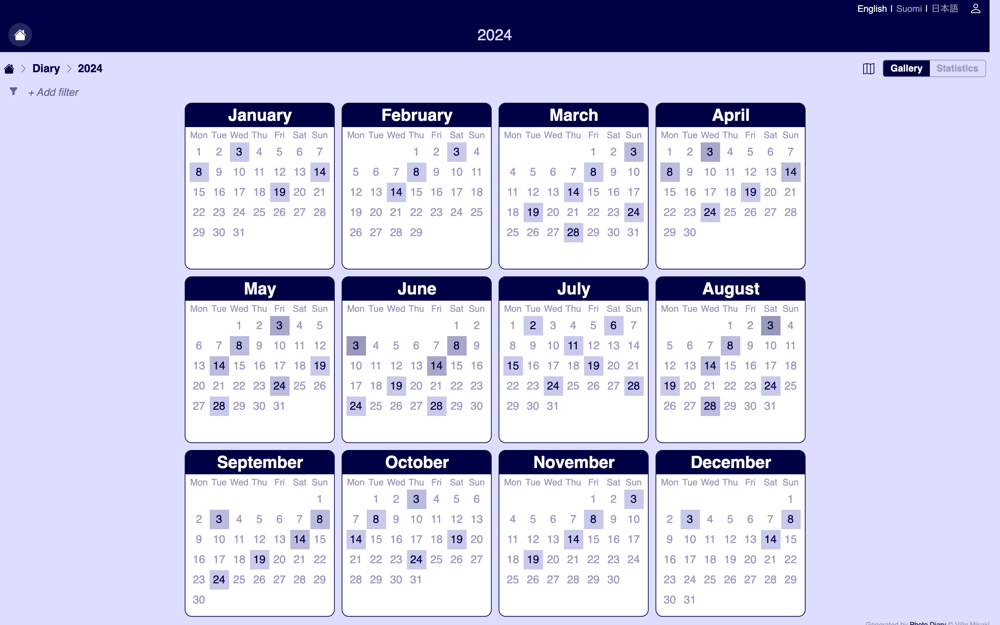
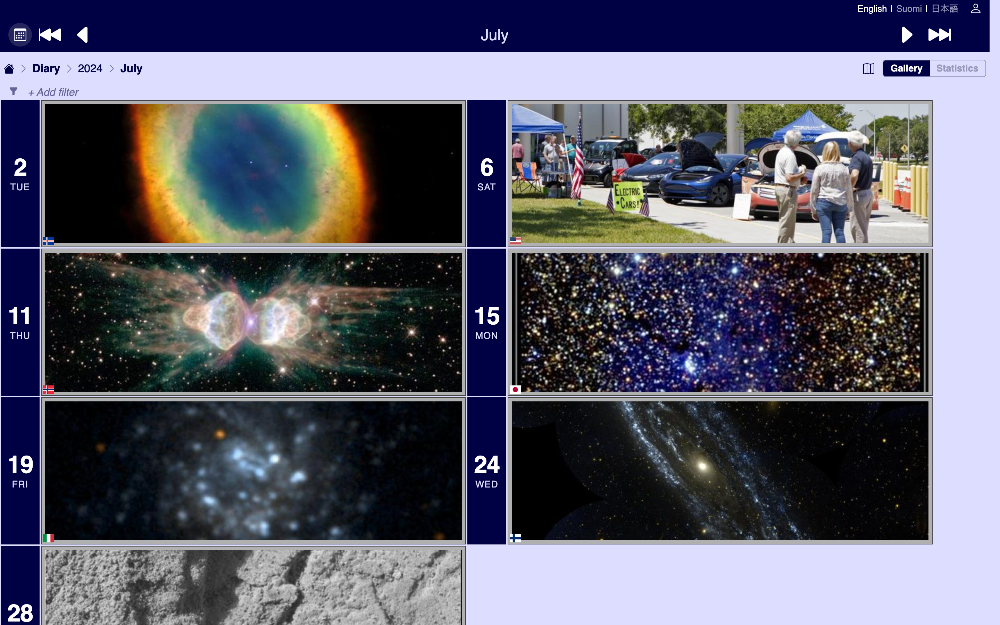
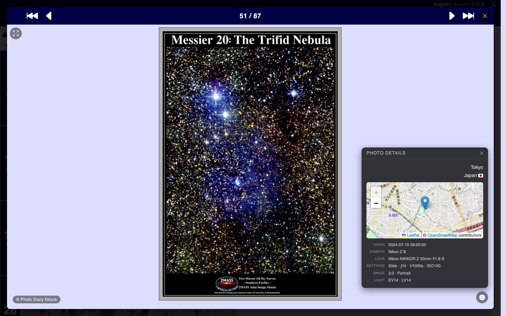
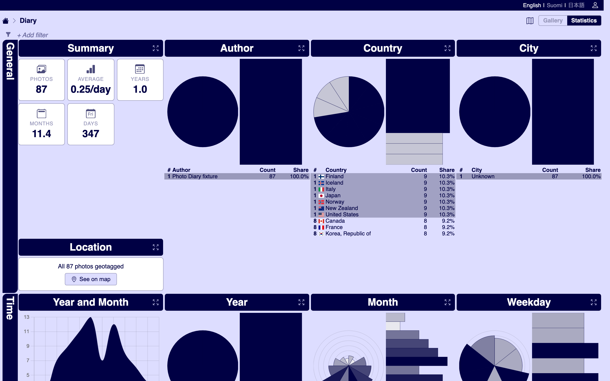

# Screenshots

Captured from a local instance seeded with the fixture under [docs/fixtures/screenshots/](fixtures/screenshots/). Photos are public-domain placeholders that look obviously demo-shaped rather than real-diary-shaped — see [PROMPTS.md](fixtures/screenshots/PROMPTS.md) for the AI-generation prompts a future refresh should use.

To regenerate: `cd docs/fixtures/screenshots && npx tsx seed.mjs && npx tsx capture.mjs`. Output lands in this directory.

## Year calendar

The gallery's landing for a given year — twelve monthly mini-calendars with the day-shade scaled to how many photos were taken that day. Click any day to drill into the month / day / photo views.

## Month calendar

Day tiles for the selected month, photos grouped by date and rendered as wide thumbnails next to each day's tile. The title-bar segmented control jumps between Gallery and Statistics; the breadcrumb above the strip is the navigation backbone.

## Photo modal

Full-screen photo with the corner Photo Details panel — EXIF (camera / lens / settings), date, location with reverse-geocoded place, and a Leaflet map zoomed to the photo's coordinates. The position indicator above (`51 / 87`) tracks the current photo in the filtered set; prev/next chrome on either side wraps at the edges.

## Statistics

Per-gallery stats — Summary tile (photos / average per day / years / months / days), Author / Country / City donuts, Location card, and the start of the Time row (Year and Month, Year, Month, Weekday). Each chart segment is clickable as a filter; scrolling continues with Hour, Gear, Exposure, and Image topics.

